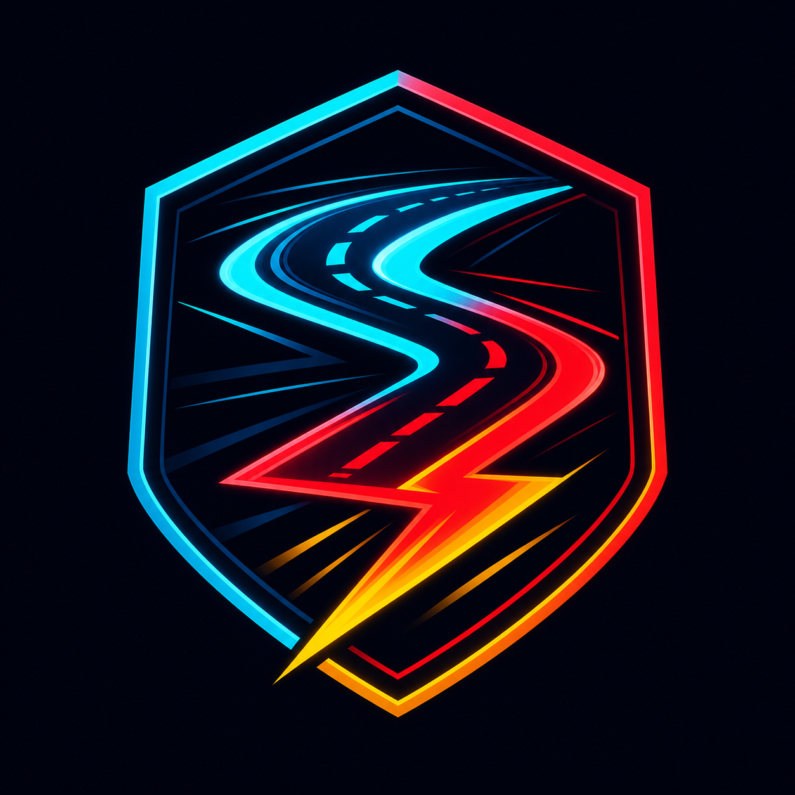

<div align="center">
  
  <h1>SRIDHAR RUSH 🏎️</h1>
  <h3>Online 3D racing for the browser — <i>your phone is the joystick.</i></h3>
  <p>Scan a QR code. Your phone becomes a wireless gamepad. Race a friend across the internet.<br/>
  <b>No installs. No downloads. Just a link.</b></p>

  <h2>🌐 PLAY NOW: <a href="https://sridhar-drift.vercel.app">https://sridhar-drift.vercel.app</a></h2>

  <p>
    <a href="https://sridhar-drift.vercel.app"></a>
    
    
    
  </p>
  
</div>

---

## 📖 Contents

1. [What is Sridhar Rush?](#-what-is-sridhar-rush)
2. [How to access the game (URLs)](#-how-to-access-the-game)
3. [How to play — from zero to chequered flag](#-how-to-play--from-zero-to-chequered-flag)
4. [Controls reference](#-controls-reference)
5. [Game modes](#-game-modes)
6. [Circuits](#-circuits)
7. [Complete feature catalogue](#-complete-feature-catalogue)
8. [Achievements & streaks](#-achievements--streaks)
9. [Leaderboards explained](#-leaderboards-explained)
10. [Settings reference](#-settings-reference)
11. [For the owner: ops & analytics](#-for-the-owner-ops--analytics)
12. [From creation to today — the story](#-from-creation-to-today--the-story)
13. [Architecture & tech stack](#-architecture--tech-stack)
14. [Developer guide (run, deploy, test)](#-developer-guide)
15. [Troubleshooting / FAQ](#-troubleshooting--faq)
16. [About the author](#-about-the-author)

---

## 🎯 What is Sridhar Rush?

Sridhar Rush is a **real-time multiplayer 3D racing game** that runs entirely in a web browser:

- 💻 A **laptop/desktop** opens the game and renders the race.
- 📱 **One or two phones** join by scanning a QR code and become **wireless joysticks** (steering stick, pedal stick, nitro button, optional tilt-steering, vibration feedback).
- 🌐 A **server-authoritative simulation** (30 Hz) keeps every screen in sync across the internet, so nobody can cheat by editing their browser.

It also works **solo**: drive with the keyboard against a ROOKIE or PRO AI opponent.

---

## 🌐 How to access the game

| What | URL |
|---|---|
| 🏁 **Main game (laptop)** | **https://sridhar-drift.vercel.app** |
| 🕹️ Joystick page (phone) | https://sridhar-drift.vercel.app/controller — or just scan the QR shown in the lobby |
| 🔗 Join a specific room | `https://sridhar-drift.vercel.app/?room=CODE` (the lobby shows your code + ready-made link) |
| 👻 Race a friend's ghost | `https://sridhar-drift.vercel.app/?g=ID` (shared from their results screen) |
| 🎥 Watch a replay | `https://sridhar-drift.vercel.app/replay?g=ID` |

The game needs **HTTPS + a modern browser** (Chrome/Edge/Firefox/Safari). Nothing to install — though you *can* install it as an app (see Features).

---

## 🎮 How to play — from zero to chequered flag

### Step 1 — Open the game (laptop)
Go to **https://sridhar-drift.vercel.app**. You land in the **lobby**: your room code, a QR code, and the race setup.

### Step 2 — Connect joysticks (optional but recommended)
- Grab a phone → open its camera → **scan the QR** in the lobby → the phone becomes **PLAYER 1's joystick**.
- A second phone can scan the same QR for **PLAYER 2**.
- No phone? Just use the **keyboard** (WASD) — the game says *"Waiting for joysticks (or drive with keyboard)"*.

### Step 3 — Set up your race
1. **Pick a mode** (Rival Rush, Solo Rush, Local Duel, Elimination, Drift Score).
2. **Pick a circuit** (5 themed tracks).
3. **Pick your car** (8 paint jobs) and **car class** (Velocity / Accel / Grip).
4. Choose **laps** (1/3/5) and **AI opponent** on/off + **AI level** (ROOKIE for learnable races, PRO for a fight).
5. Press **🏁 START RACE**.

### Step 4 — Race!
- **3‑2‑1‑GO** countdown → the phones vibrate on GO.
- Drive, grab **nitro** (meter builds while you drift), drift corners for points, avoid tire stacks and fences.
- The HUD shows speed, gear, lap, position, ping and (optional) FPS. The **minimap** shows both cars.
- First to complete all laps wins → **confetti, results screen**, lap times and best laps.

### Step 5 — After the flag
- **🔁 REMATCH** — instant re-race.
- **📤 SHARE** — copies your results as text.
- **👻 RACE MY GHOST** / **🎥 REPLAY LINK** — share your lap so friends race *you* or watch you.
- **📸 SAVE PHOTO** — downloads a branded results poster PNG for WhatsApp status.

---

## 🕹️ Controls reference

| 📱 Phone joystick | | ⌨️ Keyboard | |
|---|---|---|---|
| Left stick | Steer | W / ↑ | Throttle |
| Right stick | Gas / brake | S / ↓ | Brake / reverse |
| A / D arrows | Steer buttons | A D / ← → | Steer |
| **NITRO** button | Boost | Shift | Nitro |
| **DRIFT** button | Handbrake drift | Space | Drift |
| 🔄 gyro button | Tilt-to-steer | C | Camera view |
| 📳 | Vibration on/off | | |

---

## ⚔️ Game modes

| Mode | Goal |
|---|---|
| ⚔️ **Rival Rush** | 1v1 — each laptop follows its own car across the internet |
| 🏎️ **Solo Rush** | Co-op: both phones drive ONE car together |
| 🏁 **Local Duel** | Split-screen 2 cars on one laptop |
| ❌ **Elimination** | Last place is dropped every lap |
| 🌀 **Drift Score** | Highest drift points wins |

---

## 🗺️ Circuits

| Circuit | Theme |
|---|---|
| HIGHLAND RUSH | Day · forests & mountains |
| NEON CITY | Night · neon downtown (bloom looks best here) |
| ISLAND MOTORFEST | Sunset · volcano & ocean |
| CANYON CHICANE | Desert · S-curves & chicanes |
| HAIRPIN GP | Snow · alpine hairpins |

---

## ✨ Complete feature catalogue

**Multiplayer & feel**
- 📱 Phone-as-joystick over WebSocket with QR pairing; 🔄 gyro steering; 📳 haptics (GO, impacts, nitro, finish).
- 🌍 Cross-laptop rooms (`/?room=CODE`), ⚡ Quick-Play matchmaking, 🤖 ROOKIE/PRO AI (new players default to winnable ROOKIE).
- 🎥 30 Hz server-authoritative sim with client interpolation; low-bandwidth mode for weak networks.

**Progression**
- 🔐 Optional email accounts (Supabase) → your times follow you across devices.
- 🏆 Leaderboards: per-map **TOP 5**, **📅 Daily Challenge** (today-only board, rotates at UTC midnight), **🏆 Founders Cup** (weekly, resets Mondays).
- 🔥 Streak badge for consecutive play days; 🎖️ 5 achievements (First Win, 3-Day Streak, Lap < 0:30, Ghost Beaten, All 5 Circuits).
- 👻 Ghost replay: race your own best lap; **share ghosts** so friends race you remotely.

**Social & sharing**
- 🟢 WhatsApp / ✈️ Telegram one-tap invites with prefilled room link.
- 🎥 Watchable **replay links** (top-down spectator player with pause/scrub/×2).
- 📸 **Photo-finish** branded results PNG; 🖼️ per-map share cards + QR poster kit.

**Product & accessibility**
- 📲 Installable PWA (home-screen app, offline lobby); iOS "Add to Home Screen" hint.
- 🌐 Lobby languages: **English / తెలుగు / हिंदी** (🌐 button).
- ♿ Reduced motion, colorblind-friendly UI, quality tiers, mute/music, FPS meter, adaptive resolution + **auto smoothness ladder** (drops glow/shadows if FPS sustains under 45).
- 💡 Neon bloom (UnrealBloom, lazy-loaded, HIGH only), ACES tone mapping, vignette, speed-lines, confetti, synth music.

---

## 🎖️ Achievements & streaks

| Medal | Unlock |
|---|---|
| 🥇 First Win | Win any race |
| 🔥 3-Day Streak | Play 3 consecutive days |
| ⚡ Lap Under 0:30 | Set a sub-30s lap |
| 👻 Ghost Beaten | Finish ahead of a shared ghost |
| 🌍 All 5 Circuits | Lap every circuit |

Medals glow on your lobby name row once earned (stored on your device).

---

## 🏆 Leaderboards explained

- **TOP 5 (per map)** — all-time best for the selected circuit; signed-in players keep one row per account.
- **📅 DAILY** — only *today's* times; new circuit every day; **▶ PLAY TODAY'S MAP** jumps you in.
- **🏆 FOUNDERS CUP** — best times *this week* across all maps; **📤 SHARE CUP** challenges friends on WhatsApp.

---

## ⚙️ Settings reference

GFX LOW/MED/HIGH · 🔇 Mute · 🎵 Music ·  FPS meter ·  Reduced motion ·  Colorblind UI · ⚙️ Adaptive resolution · 👻 Ghost · 💡 Glow FX · 🤖 AI opponent + AI LEVEL · 🌐 Language.

---

## 🛠️ For the owner: ops & analytics

Relay endpoints (all CORS-open, privacy-friendly — no IPs/cookies):
`/version` · `/health` · `/stats` (visits, races, finishes, installs, crash counts + last errors) · `/lb?map=N[&daily=1]` · `/daily` · `/cup` · `/recent` · `POST /a` (beacons) · `GET/POST /ghost`.

Optional env vars (every feature degrades gracefully without them):

| Var | Where | Purpose |
|---|---|---|
| `SERVER_URL` | Vercel | public relay URL baked into `config.js` |
| `SUPABASE_URL` + `SUPABASE_ANON` | Vercel | browser auth + reads |
| `SUPABASE_URL` + `SUPABASE_SERVICE_ROLE` | Relay | server-side writes (boards, ghosts) |
| `COMMUNITY_WA` / `COMMUNITY_DC` | Vercel | lobby community buttons |
| `LOW_BANDWIDTH=1` | Relay | lean tick/telemetry rates |

---

## 📜 From creation to today — the story

Built by one developer as a *"can a browser feel like Asphalt?"* experiment, Sridhar Rush grew through ~50 disciplined releases:

| Era | Milestones |
|---|---|
| **v1–v28** | Core: 3D renderer, 5 circuits, physics (drift/nitro), phone-joystick WebSocket pairing, HUD, music, PWA shell |
| **v29–v33** | Multiplayer depth: quick-play matchmaking, account-lite ids, global leaderboard endpoint, accessibility pass, solid collision rebuild for splined tracks |
| **v34–v38** | Retention: ghost replay, neon bloom, installable PWA + icons, Supabase accounts + cross-device boards, alive-lobby (recent finishes + daily challenge), phone haptics, crash beacons |
| **v39–v45** | Growth: WhatsApp/Telegram invites, race-my-ghost links, weekly Founders Cup, EN/TE/HI i18n, ROOKIE/PRO AI, community buttons |
| **v46–v50** | Brand & polish: logo/posters/og-cards, 🎥 replay spectator page, 🎖️ achievements, 📸 photo-finish, non-blocking fonts, HUD smoothness pass, **auto smoothness ladder** |

Design rules kept throughout: **server-authoritative** (no trust in clients), **additive releases** (features flag-guarded, game never disturbed), **tested releases** (node harnesses + live race smoke + network-cadence probes).

---

## 🧠 Architecture & tech stack

```
 phones (WebSocket input) ──┐
                            ├─▶ Node relay — 30 Hz authoritative sim, telemetry,
 laptops (render clients) ──┘    leaderboards, ghosts, analytics beacons
      │  three.js r128 scene · bloom · adaptive resolution · interpolation
      └─ Supabase (optional): auth, global leaderboard, shared ghosts
 Frontend: Vercel (static + headers + rewrites) · Relay: Railway/Render · DB: Supabase free tier
```

Stack: **three.js r128 · vanilla ES6 (no framework) · Node/Express · ws · Supabase PostgREST/GoTrue · Vercel · Railway · ImageMagick-generated brand kit**.

---

## 💻 Developer guide

**Repo layout** — game source is flat in [`delivery/`](delivery/) and maps to the deploy repo:

| `delivery/` | deploy target |
|---|---|
| `game-core.js` | `shared/game-core.js` (deterministic physics; copied to `public/js/` at build) |
| `game.js` `net.js` `account.js` `i18n.js` `replay.js` `controller.js` | `public/js/…` |
| `index.html` `controller.html` `replay.html` | `public/…` |
| `style.css` `controller.css` | `public/css/…` |
| `sw.js`, `*.webmanifest`, `img/` | `public/…` |
| `server.js` `vercel.json` `render.yaml` `package.json` | repo root |
| `supabase-setup.sql` | run once in Supabase SQL editor |

**Run locally**
```bash
cd delivery && npm install && node server.js   # http://localhost:3000
```

**Testing** — every release is gated by node harnesses (ghost 19, bloom pipeline 8, SW routing 15, haptics 7, analytics 7, alive-lobby 11, ghost-links 5, achievements 8, auto-tune 7, i18n parity, bot-difficulty differential) plus live race smoke tests and a 15 s cadence probe (30 Hz ± 0.5 ms).

---

## ❓ Troubleshooting / FAQ

| Symptom | Fix |
|---|---|
| "Connection lost — retrying" | Relay redeploying or offline; wait a few seconds. Check `/health`. |
| Phone won't pair | Same QR only holds 2 phones; open `/?room=CODE` manually; check HTTPS. |
| Low FPS | Settings → GFX MED/LOW; the auto-ladder also drops glow/shadows under 45 FPS. ~50 FPS on a 50 Hz screen is the physical max. |
| iPhone install | No prompt on iOS: Share ⬆ → *Add to Home Screen* (the controller shows a hint). |
| Sign-in asks for email confirm | In Supabase: Authentication → Sign In / Providers → Email → turn **Confirm email** OFF. |
| Leaderboard empty | Boards fill as people race — be the first and share the Cup link! |

---

## 👤 About the author

**Yatham Sridhar Reddy** — Cloud & DevOps focused CSE undergrad (B.Tech '27) · AWS Certified Developer · OCI Architect · 400+ DSA problems solved.
This repository doubles as my GitHub profile; Sridhar Rush is my favourite build — from physics to posters, all of it.

<p>
  <a href="https://www.linkedin.com/in/yatham-sridhar-reddy-744177374/"></a>
  <a href="https://yathamsridharreddy.github.io/sridhar-portfolio"></a>
  <a href="mailto:yathamsridharreddy99@gmail.com"></a>
</p>

---

<div align="center">
  <b>🏁 See you on the track — <a href="https://sridhar-drift.vercel.app">sridhar-drift.vercel.app</a></b>
</div>
