  

  

 

  
  
  

  

👨‍💻 About Me

I'm Yatham Sridhar Reddy, a Computer Science Engineering student focused on Cloud/DevOps, Backend Development, and Full Stack Engineering.

I enjoy building systems end-to-end — from application code and APIs to containers, CI/CD pipelines, cloud infrastructure, automation, and deployment.

🎓 B.Tech Computer Science Engineering — 2027

☁️ Cloud & DevOps focused

🚀 AWS, OCI, Docker, Linux & CI/CD

💻 Python backend development

🌐 Full Stack development

🧠 400+ DSA & competitive programming problems

🏗️ Building real-world cloud and web applications

🧰 Tech Stack

☁️ Cloud & DevOps

  

💻 Programming & Backend

  

🌐 Web & Databases

  

⚡ Engineering Workflow

**BUILD** → **CONTAINERIZE** → **AUTOMATE** → **DEPLOY** → **OBSERVE** → **SCALE**

From application code to reliable production infrastructure.

🚀 Featured Projects

🏎️ Sridhar Rush

Real-time multiplayer 3D browser racing

A multiplayer racing experience with phone-as-controller support, real-time WebSockets, Three.js rendering, server-authoritative simulation, AI opponents, progression, leaderboards and PWA support.

`JavaScript` `Three.js` `Node.js` `Express` `WebSockets`

  
  

☁️ Cloud Compare AI

AI + Cloud Engineering

An AI-focused cloud project combining application development with practical cloud comparison and decision-support concepts.

`Python` `AI` `Cloud` `Backend` `Web`

☁️ CloudSmiths

Cloud Engineering & Automation

A cloud-focused project centered around practical infrastructure, automation, deployment, and modern cloud application engineering.

`Cloud` `DevOps` `AWS` `Automation` `Backend`

🧠 Problem Solving

  
  
  

🏆 Certifications

  
  
  

📊 GitHub Analytics

  

🐍 Contribution Activity

  <picture>
    <source media="(prefers-color-scheme: dark)" srcset="./assets/github-contribution-grid-snake-dark.svg" />
    <source media="(prefers-color-scheme: light)" srcset="./assets/github-contribution-grid-snake.svg" />
    
  </picture>

📈 Development Activity

  

🎯 Current Direction

Cloud Architecture
        ↓
Infrastructure as Code
        ↓
Containers & CI/CD
        ↓
Automation & Observability
        ↓
Reliable Production Systems

🤝 Let's Connect

  
  
  

  

  Build • Automate • Deploy • Scale

