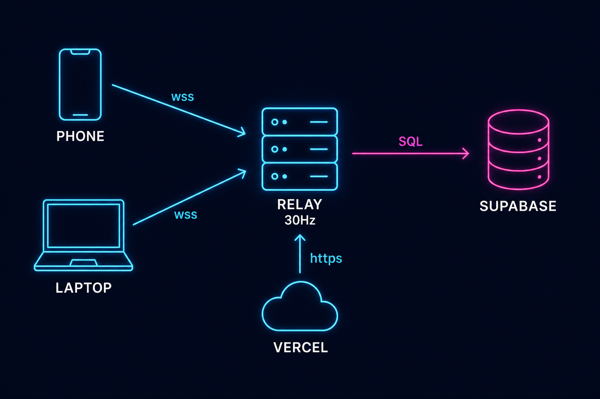

<div align="center">


# 🏎️ SRIDHAR RUSH
### **Your phone is the joystick. The browser is the console. The internet is your racetrack.**

<a href="https://sridhar-drift.vercel.app"></a>

     

*Scan → Join → Race. No installs. No sign-up. Just a link.* 🌍

</div>

---

## 🎬 Wait, what is this?

> **Sridhar Rush** is a real-time 3D racing game where **laptops render the race** and **phones become wireless gamepads** — scan a QR code and your phone grows sticks, nitro and haptics. Race a friend across the internet, or duel a ROOKIE/PRO AI with WASD.


**The loop that hooks you:**
🏁 win your first race vs ROOKIE → 🔥 keep the streak → 📅 top the Daily board → 🏆 take the weekly Founders Cup → 👻 ghost-share your lap so friends race *you* → 📸 flex the photo-finish card on WhatsApp.

<br clear="both"/>

---

## 🗺️ Pick your battleground

| | | |
|:---:|:---:|:---:|
| <br/>**HIGHLAND RUSH**<br/>🌲 day · forests & mountains | <br/>**NEON CITY**<br/>🌃 night · bloom-soaked downtown | <br/>**ISLAND MOTORFEST**<br/>🌋 sunset · volcano & ocean |
| <br/>**CANYON CHICANE**<br/>🏜️ desert · S-curves | <br/>**HAIRPIN GP**<br/>❄️ snow · alpine hairpins | <br/>**YOUR FAVOURITE?**<br/>🏁 settle it on track |

---

## ⚡ Play in 60 seconds

1. 💻 Open **https://sridhar-drift.vercel.app**
2. 📱 Scan the QR — your phone becomes a joystick *(second phone = player 2!)*
3. 🎨 Pick mode + circuit + car → **🏁 START RACE**
4. 📳 Feel the phones vibrate on **GO** — drift to charge nitro, burn it on the straights
5. 🏆 Confetti. Results. **📸 photo · 👻 ghost link · 🎥 replay** — send them to a friend.

*No phone? `WASD` + `Shift` nitro + `Space` drift vs the AI.* ⌨️

---

## ⚔️ Five ways to fight

| Mode | The rule |
|---|---|
| ⚔️ **RIVAL RUSH** | 1v1 across the internet — each laptop chases its own car |
| 🏎️ **SOLO RUSH** | co-op: two phones, **one** car, shared destiny |
| 🏁 **LOCAL DUEL** | split-screen showdown on a single laptop |
| ❌ **ELIMINATION** | last place drops **every lap** — stay sharp |
| 🌀 **DRIFT SCORE** | sideways is forwards — most drift points wins |

---

## ✨ The feature wall

| 🌍 Multiplayer | 🏁 Racing | 🏆 Progression | 📱 Product |
|---|---|---|---|
| 📱 phone gamepad + QR | 🏎️ nitro ↔ drift economy | 🔐 email accounts | 📲 installable PWA |
| 🔄 gyro tilt steering | 👻 ghost of your best lap | 🏅 5 achievements | 🌐 EN · తెలుగు · हिंदी |
| 📳 haptic GO/crash/finish | 🎥 spectator replay page | 🔥 daily streak badge | ♿ reduced-motion + colorblind |
| ⚡ quick-play matchmaking | 🤖 ROOKIE/PRO AI | 📅 Daily Challenge board | 💡 neon bloom (lazy, HIGH) |
| 🔗 cross-laptop rooms | 💥 capsule-true collisions | 🏆 weekly Founders Cup | ⚙️ auto smoothness ladder |
| 🟢 WA / TG invites | 🛞 on-track tire hazards | 🥇 per-map TOP‑5 | 📸 photo-finish cards |

<details>
<summary> <b>Under the hood</b> — the engineering fine print (click)</summary>

- **Server-authoritative 30 Hz sim**; clients send inputs only and interpolate 120 ms behind — measured cadence **33.2 ms ± 0.5 ms**, zero gaps > 100 ms.
- **One physics file everywhere:** `shared/game-core.js` runs identically in Node and browser (seeded RNG ⇒ identical worlds).
- **Track boundary = analytic constraint**, not fence tiles: center+nose+tail probes re-project onto the drawn centerline every tick ⇒ no gaps, no tunneling at any speed/angle/drift/reverse; audited with 10 exploit classes × 4 maps ⇒ **0 escapes**, cost **0.009 ms/frame**.
- **Graceful everywhere:** Supabase, community links, bloom — all env/quality gated; zero env vars still = full game.
- **Privacy-first ops:** `/stats` counts beacons only (no IPs/cookies), crash reports remote, CSP + RLS (public read, server-only writes).

</details>

---

## 🧠 How it's built



| Layer | Tech | Job |
|---|---|---|
| ️ Client | three.js r128 · vanilla ES6 · SW | 3D scene, bloom, interpolation, PWA |
| 📡 Relay | Node + Express + ws (Railway/Render) | authoritative rooms, physics, boards |
| 🗄️ Data | Supabase Postgres (optional) | accounts, global boards, shared ghosts |
| 🚚 Edge | Vercel | static hosting, CSP, immutable cache, rewrites |

---

## 🏅 Brag properly

| 🥇 First Win | 🔥 3-Day Streak | ⚡ Lap < 0:30 | 👻 Ghost Beaten | 🌍 All 5 Circuits |
|:---:|:---:|:---:|:---:|:---:|
| beat anyone | show up daily | one flying lap | humble a friend's ghost | complete the tour |

*Boards:* **TOP‑5** per map · **📅 Daily** (resets UTC midnight) · **🏆 Founders Cup** (resets Mondays) — share the Cup on WhatsApp and defend it.

---

## 🚀 Run / deploy your own

```bash
cd delivery && npm i && node server.js        # → http://localhost:3000
```

| Env (all optional) | Where | Unlocks |
|---|---|---|
| `SERVER_URL` | Vercel | client→relay wiring |
| `SUPABASE_URL`+`_ANON` | Vercel | accounts & boards in browser |
| `SUPABASE_URL`+`_SERVICE_ROLE` | Relay | server-side writes |
| `COMMUNITY_WA` / `COMMUNITY_DC` | Vercel | lobby community buttons |
| `LOW_BANDWIDTH=1` | Relay | lean mode for weak networks |

<details>
<summary>🗂️ <b>Repo → deploy mapping</b> (click)</summary>

`delivery/` is flat; deploy repo maps: `game-core.js → shared/`, `game.js|net.js|account.js|i18n.js|replay.js|controller.js → public/js/`, HTML/CSS/SW/manifests/img → `public/`, `server.js|vercel.json|render.yaml|package.json` → root, `supabase-setup.sql` run once. ⚠️ Vercel's build copies `shared/game-core.js` into `public/js/` every deploy — keep it fresh.

</details>

---

## 🧪 Tested like a shipped product

`escape-hunt ×10 exploit classes` · `ghost 19` · `bloom 8` · `SW 15` · `haptics 7` · `analytics 7` · `alive-lobby 11` · `ghost-links 5` · `achievements 8` · `auto-tune 8` · `i18n parity` · `race smoke 0/1/4` · `cadence probe`

---

## ❓ Quick fixes

| 😖 | 😌 |
|---|---|
| red "OLD GAME CORE" screen | re-curl `shared/game-core.js` from the latest release, redeploy |
| ~50 FPS cap | 50 Hz display vsync — auto-ladder sheds glow < 52 |
| iPhone install | Share ⬆ → *Add to Home Screen* |

---

<div align="center">

### built with 🖤 & nitro by
## Yatham Sridhar Reddy
*Cloud & DevOps · AWS Certified · OCI Architect · B.Tech '27 · 400+ DSA*

<a href="https://www.linkedin.com/in/yatham-sridhar-reddy-744177374/"></a>
<a href="https://yathamsridharreddy.github.io/sridhar-portfolio"></a>
<a href="mailto:yathamsridharreddy99@gmail.com"></a>

**🏁 see you on the track → [sridhar-drift.vercel.app](https://sridhar-drift.vercel.app)**

</div>
